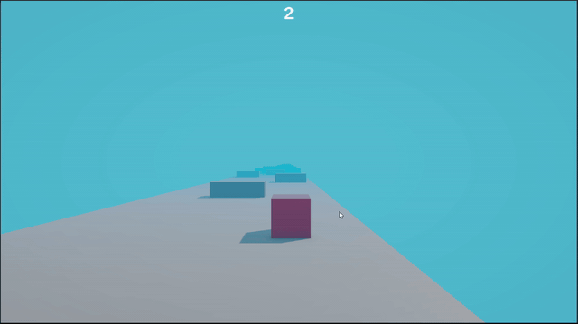

# Platformer 3D — Unity 6 / URP Prototype

A 3D endless runner built in **Unity 6.0 (6000.0.40f1)** with the **Universal Render
Pipeline**. The player auto-runs down a narrow track, steers left and right to weave
through obstacles, and scores a point for each one cleared. Hit an obstacle or fall off
the edge and the run restarts.

> **Status: small prototype.** One scene, one gameplay script. Built to get a complete
> core loop — movement, scoring, fail state, camera — working end to end.

---

## Demo



*Constant forward motion; steering is the only input. The score counts obstacles cleared.*

▶️ **[Full clip (22s, 1280p)](docs/demo.mp4)** — a full run through to a crash and restart.

---

## Controls

| Input | Action |
|---|---|
| `A` / `D` or `←` / `→` | Steer left / right |

---

## How it works

| System | Implementation |
|---|---|
| Movement | Constant forward velocity on the `Rigidbody`, horizontal steering from the `Horizontal` input axis |
| Scoring | `OnTriggerEnter` against an `Obstacle` increments the score, rendered with TextMesh Pro |
| Fail state | `OnCollisionEnter` against an `Obstacle` reloads the active scene |
| Camera | Cinemachine third-person follow, trailing the player |

All gameplay logic lives in a single script:
[`Assets/Scripts/PlayerMovement.cs`](Assets/Scripts/PlayerMovement.cs).

---

## Tech stack

| Area | Choice |
|---|---|
| Engine | Unity 6.0 LTS (`6000.0.40f1`) |
| Render pipeline | URP 17.0.4 |
| Camera | Cinemachine 3.1.5 |
| UI | TextMesh Pro |
| Input | Input System 1.13.0 installed; movement reads the legacy `Horizontal` axis |

---

## Running it

```bash
git clone https://github.com/bensinvani/3d-platformer.git
```

Open with **Unity 6000.0.40f1** (Unity Hub will offer to install it if missing) and load
`Assets/Scenes/GameScene.unity`, then press Play.

Packages resolve automatically on first open. Note that `Packages/manifest.json`
references `com.coplaydev.unity-mcp` from a Git URL — an editor-only tooling package
that is not part of the game. Remove that line if you'd rather not fetch it.

---

## AI-assisted editing

The project has [MCP for Unity](https://github.com/CoplayDev/unity-mcp) wired up
([`.mcp.json`](.mcp.json)), so an MCP client such as Claude Code can read and
modify the scene, GameObjects, and scripts directly in the running editor.
